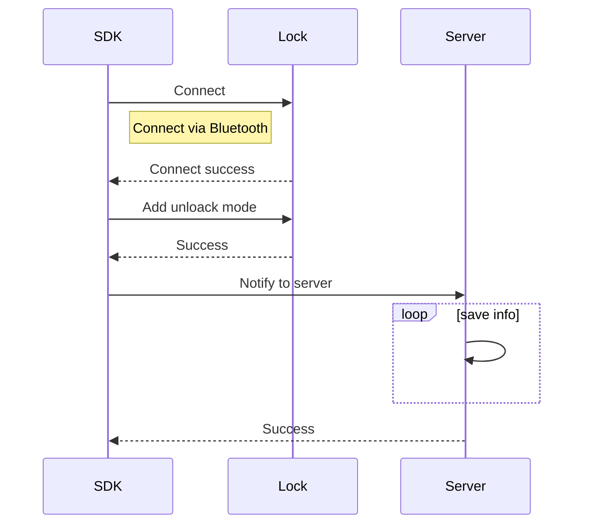

# Tuya BLE Lock Instructions

## Term Explanation

| Term                   | Explanation                                                  |
| ---------------------- | ------------------------------------------------------------ |
|dpCode|The identifier of the device function point. Each function point in the device has a name and number. Please refer to [BLE Door Lock Function Points](#ble-door-lock-function-points)|
| hijack           | Door lock hijacking refers to setting a specific password (fingerprint, password, etc.) as the hijacking password. <br/> When the user enters this password to open the door, the door lock considers the user to open the door involuntarily, and sends the alarm information to the family's mobile phone or property management system. |
| door lock member | Door lock members are divided into family members and non-family members. <br/> Family members are members who are added to the user's family. The door lock can be used to manage family members and set the unlock mode. <br/> Non-family members are members created in door locks and can be managed through door lock related interfaces. |
| lockUserId and userId | `lockUserId` is the firmware member id assigned to the device by the cloud when creating the door lock member. <br />`userId` is the database record id assigned by the cloud when creating the door lock member, means the user's unique id |

## Description

| Class Name                    | **Description**                                              |
| ----------------------------- | ------------------------------------------------------------ |
| `TuyaOptimusSdk`   | SDK init class, used to create `ITuyaLockManager` |
| `ITuyaLockManager` | Lock manager class, used to create `ITuyaBleLock` |
| `ITuyaBleLock` | BLE door lock class, all BLE door lock APIs are in it |

Create `ITuyaBleLock` by device id:

```java
// init sdk
TuyaOptimusSdk.init(getApplicationContext());
// get ITuyaLockManager
ITuyaLockManager tuyaLockManager = TuyaOptimusSdk.getManager(ITuyaLockManager.class);
// create ITuyaBleLock
ITuyaBleLock tuyaLockDevice = tuyaLockManager.getBleLock(your_device_id);
```

## Member Management

The door lock can be divided into family members and non-family members. Family members are concepts in the whole house intelligence, you can refer to the [Family Member Management](https://tuyainc.github.io/tuyasmart_home_android_sdk_doc/en/resource/HomeMember.html)  for details.

### Get Lock Members
**Description**

```java
/**
 * get lock users
 */
public void getLockUsers(final ITuyaResultCallback<List<BLELockUser>> callback)
```

**Parameters**

**`BLELockUser ` data model**

|Field|Type|Description|
|---|---|---|
|userId|String|user id|
|lockUserId|int|user id in lock device|
|userContact|String|user contact|
|nickName|String|user nick name|
|avatarUrl|String|avatar url|
|userType|int|User type, 10 is administrator, 20 is ordinary home user, 30 is door lock user|
|supportUnlockTypes|List<String>|Supported unlock types, you can check the unlock type in TuyaUnlockType|
|effectiveTimestamp|long|User effective timestamp, unit ms|
|invalidTimestamp| long |User failure timestamp, unit ms|

**Example**

```java
tuyaLockDevice.getLockUsers(new ITuyaResultCallback<List<BLELockUser>>() {
    @Override
    public void onError(String code, String message) {
        Log.e(TAG, "get lock users failed: code = " + code + "  message = " + message);
    }

    @Override
    public void onSuccess(List<BLELockUser> user) {
        Log.i(TAG, "get lock users success: lockUserBean = " + user);
    }
});
```

### Create Lock Member

SDK support add member for lock device

```sequence
Title: create lock member

participant app
participant server

note over app: write member info
app->server: send create member request
server-->app: response result
note over app: show result
```

> Note:  For non-family members created here,  family members needs to refer to the document  [Family Member Management](https://tuyainc.github.io/tuyasmart_home_android_sdk_doc/en/resource/HomeMember.html).

**Description**

```java
/**
 * add lock user
 *
 * @param userName           userName
 * @param allowedUnlock      Whether allowed unlock with bluetooth
 * @param permanent          Whether the user is permanent
 * @param effectiveTimestamp User effective time
 * @param invalidTimestamp   User invalid time
 * @param avatarFile         avatar
 * @param callback           callback
 */
void addLockUser(final String userName, boolean allowedUnlock, boolean permanent, long effectiveTimestamp, long invalidTimestamp, File avatarFile, final ITuyaResultCallback<Boolean> callback);
```

**Parameters**

|Parameter|Description|
|---|---|
| userName |user name|
| allowedUnlock |Allow users to unlock using Bluetooth|
| unlockType |Unlock type, you can check TuyaUnlockType|
| permanent |Whether it is a permanent user|
| effectiveTimestamp |User effective timestamp, unit ms, if the permanent value is true, the value can be ignored|
| invalidTimestamp |User expiry timestamp, unit ms, if the permanent value is true, this value can be ignored|
| avatarFile |avatar file|

**Example**

```java
tuyaLockDevice.addLockUser("your_user_name", true, true, 0, 0, null, new ITuyaResultCallback<Boolean>() {
    @Override
    public void onError(String code, String message) {
        Log.e(TAG, "add lock user failed: code = " + code + "  message = " + message);
    }

    @Override
    public void onSuccess(Boolean result) {
        Log.i(TAG, "add lock user success");
    }
});
```

### Update Lock Member

SDK provides the function of modifying the members of the lock. The members of the lock will interact with the hardware and require the device to maintain a Bluetooth connection.

```sequence
Title: Update Lock Member

participant server
participant app
participant lock

note over app: write new user info
app->lock: create bluetooth connection
app->lock: send device update member command data
lock-->app: receive device update result
app->server: send request, update member
server-->app: return result
note over app: show result
```

**Description**

```java
/**
 * update lock user
 *
 * @param userId             userId
 * @param userName           userName
 * @param allowedUnlock      Whether allowed unlock with bluetooth
 * @param permanent          Whether the user is permanent
 * @param effectiveTimestamp User effective time
 * @param invalidTimestamp   User invalid time
 * @param avatarFile         avatar
 * @param callback           callback
 */
void updateLockUser(final String userId, boolean allowedUnlock, final String userName, final boolean permanent, long effectiveTimestamp, long invalidTimestamp, File avatarFile, final ITuyaResultCallback<Boolean> callback);

```

**Parameters**

|Parameter|Description|
|---|---|
| userId | user id |
| allowedUnlock |Allow users to unlock using Bluetooth|
| userName |user name|
| permanent |Whether it is a permanent user|
| effectiveTimestamp |User effective timestamp, unit ms, if the permanent value is true, the value can be ignored|
| invalidTimestamp |User expiry timestamp, unit ms, if the permanent value is true, this value can be ignored|
| avatarFile |avatar file|

**Example**

```java
tuyaLockDevice.updateLockUser("your_user_id", true, "your_user_name", true, 0, 0, null, new ITuyaResultCallback<Boolean>() {
    @Override
    public void onError(String code, String message) {
        Log.e(TAG, "update lock user failed: code = " + code + "  message = " + message);
    }

    @Override
    public void onSuccess(Boolean aBoolean) {
        Log.i(TAG, "update lock user success");
    }
});
```

### Delete Lock Member

SDK provides the feature of deleting the member of the lock. The member of the lock will interact with the hardware and delete all unlocking methods and passwords of the user. The operation requires the device to maintain a bluetooth connection.

```sequence
Title: Delete Lock Member

participant server
participant app
participant lock

note over app: delete member
app->lock: create bluetooth connection
app->lock: send delete user command data
lock-->app: response command result
app->server: send delete user reques
server-->app: response result
note over app: show result
```

**Description**

```java
/**
 * delete lock user
 * @param user user bean
 * @param callback  callback
 */
public void deleteLockUser(BLELockUser user, final ITuyaResultCallback<Boolean> callback)
```


## Device Bluetooth Connection Status

After the Bluetooth connection is established between the mobile phone and the device, the door lock can be opened via Bluetooth.

### Determine the Lock Is Connected

**Description**

Determine whether the Bluetooth door lock is connected to the mobile phone.

The operations related to controlling the door lock basically need to call this interface to judge, and the door lock must be online to operate.

```java
/**
 *  @return if lock online, return true
 */
public boolean isBLEConnected() 
```

**Example**

```java
boolean online = tuyaLockDevice.isBLEConnected();
```

### Connect Bluetooth Door Lock

**Description**

If the door lock is not connected, call this interface to connect to the door lock

```java
/**
 * connect to lock
 *
 * @param connectListener callback BLE lock connect status
 */
public void connect(ConnectListener connectListener)
```

**Parameters**

`ConnectListener` is the callback of device connection status, `onStatusChanged` will return online status.

**Example**

```java
tuyaLockDevice.connect(new ConnectListener() {
    @Override
    public void onStatusChanged(boolean online) {
        Log.i(TAG, "onStatusChanged  online: " + online);
    }
});
```
## Dynamic Password

Use the SDK to get a dynamic password and enter it on the door lock to unlock. The dynamic password is valid for 5 minutes.

```sequence
title: Unlock with dynamic password
participant lock
participant user
participant app
participant server

app -> server: Request for dynamic password
server --> app: Returns dynamic password results
app --> user: Send password
note over user: Get dynamic password
user -> lock: Input dynamic password
note over lock: Execute

```

### Get Dynamic Password
**Description**

```java
public void getDynamicPassword(final ITuyaResultCallback<String> callback)
```

**Example**

```java
tuyaLockDevice.getDynamicPassword(new ITuyaResultCallback<String>() {
    @Override
    public void onError(String code, String message) {
        Log.e(TAG, "get lock dynamic password failed: code = " + code + "  message = " + message);
    }

    @Override
    public void onSuccess(String dynamicPassword) {
        Log.i(TAG, "get lock dynamic password success: dynamicPassword = " + dynamicPassword);
    }
});
```

## Bluetooth Unlock & Lock

### Unlock via Bluetooth

```sequence
Title: Bluetooth Unlock

participant user
participant app
participant lock

note over app: bluetooth open, lock device connected
user->app: unlock
app->lock: use ble send unlock command data
note over lock: receive command, execute
lock-->app: send unlock result
note over app: show result
```

**Description**

After the door lock is connected with the app, you can call this interface to unlock it.

```java
/**
 * unlock the door
 */
public void unlock(String lockUserId)
```

**Parameters**

|Parameter|Description|
|---|---|
| lockUserId |The user id in the door lock device |

All users will have a corresponding id in the door lock, the id starts from 1, and the number will increase by one for each new user added.

**Example**

```java
// "1" is the id of the current user in the door lock device
tuyaLockDevice.unlock("1");
```

### Lock via Bluetooth

```sequence
Title: Bluetooth Lock

participant user
participant app
participant lock

note over app: bluetooth open, lock device connected
user->app: lock
app->lock: use ble send lock command data
note over lock: receive command, execute
lock-->app: send lock result
note over app: show result
```

**Description**

```java
/**
 * lock the door
 */
public void lock()
```

**Example**

```java
tuyaLockDevice.lock();
```

## Lock Records

### Get Alarm Records

**Description**

```java
/**
 * get alarm records
 * @param offset page number
 * @param limit item count
 * @param callback callback
 */
void getAlarmRecords(int offset, int limit, final ITuyaResultCallback<Record> callback);
```


**Parameters**

|Parameter|Description|
|---|---|
|offset|page offset|
|limit|item count in one page|

**Parameters in callback**

`Record`  Description

| Field      | Type           | Description            |
| ---------- | -------------- | ---------------------- |
| totalCount | int            | total count of records |
| hasNext    | boolean        | has next page          |
| datas      | List<DataBean> | the list of records    |

`DataBean` Description

| Field          | Type                    | Description                                                  |
| -------------- | ----------------------- | ------------------------------------------------------------ |
| userId         | String                  | user id                                                      |
| unlockType     | String                  | unlock type                                                  |
| userName       | String                  | user name                                                    |
| createTime     | long                    | create timestamp, unit ms                                    |
| devId          | String                  | device id                                                    |
| unlockRelation | UnlockRelation          | The relationship between the unlock type and the unlock password number, if it is not the unlock record, it can be empty |
| tags           | int                     | record tag，0 means other, 1 means hijack alarm              |

**Example**

```java
tuyaLockDevice. getAlarmRecords(0, 10, new ITuyaResultCallback<Record>() {
    @Override
    public void onError(String code, String message) {
        Log.e(TAG, "get lock records failed: code = " + code + "  message = " + message);
    }

    @Override
    public void onSuccess(Record recordBean) {
        Log.i(TAG, "get lock records success: recordBean = " + recordBean);
    }
});
```

### Get Unlocked Records

**Description**

```java
/**
 * get unlock records
 * @param unlockTypes unlock type list 
 * @param offset page number
 * @param limit item count
 * @param callback callback
 */
void getUnlockRecords(int offset, int limit, final ITuyaResultCallback<Record> callback);
```

**Parameters**

|Parameter|Description|
|---|---|
|offset|page offset|
|limit|item count in one page|


**Example**

```java
tuyaLockDevice.getUnlockRecords(0, 10, new ITuyaResultCallback<Record>() {
    @Override
    public void onError(String code, String message) {
        Log.e(TAG, "get unlock records failed: code = " + code + "  message = " + message);
    }

    @Override
    public void onSuccess(Record recordBean) {
        Log.i(TAG, "get unlock records success: recordBean = " + recordBean);
    }
});
```


## Unlock Mode Management

This section provides interfaces for setting, modifying, and deleting unlocking methods.

The following figure shows the interactive process of adding an unlock method:



### Get Unlock Modes

**Description**

```java
/**
 * get unlock mode by unlockType
 *
 * @param unlockType unlock type {@link com.tuya.smart.optimus.lock.api.TuyaUnlockType}
 * @param callback callback
 */
void getUnlockModeList(String unlockType, final ITuyaResultCallback<ArrayList<UnlockMode>> callback);
```


**Parameters**

**`UnlockMode` data model**

|Field|Type|Description|
|---|---|---|
|userId|String|user id|
|lockUserId|int|user id in door lock device|
|userName|String|user name|
|unlockAttr|int|Unlock mode attribute, 0 is the ordinary unlock mode, 1 is the unlock mode|
|userType|int|User type, 10 is administrator, 20 is ordinary home user, 30 is door lock user|
|unlockModeId|String|The id of the current unlock mode on the server|
|unlockId|String|The id of the current unlock mode in the door lock|
|unlockName|String|The name of the current unlock mode|
|unlockType|String|unlock type，see TuyaUnlockType|

**Example**

```java
tuyaLockDevice.getUnlockModeList(TuyaUnlockType.PASSWORD, new ITuyaResultCallback<ArrayList<UnlockMode>>() {
    @Override
    public void onSuccess(ArrayList<UnlockMode> result) {
        Log.i(TAG, "getUnlockModeList  onSuccess: " + result);
    }

    @Override
    public void onError(String errorCode, String errorMessage) {
        Log.e(TAG, "getUnlockModeList failed: code = " + errorCode + "  message = " + errorMessage);
    }
});
```


### Register Unlock Mode Listener

The interfaces for adding, modifying, and deleting unlocking methods are all asynchronous calls and all return from this interface.

**Description**

```java
void setUnlockModeListener(UnlockModeListener unlockModeListener);
```

The code in `UnlockModeListener` is as follows:


```java
public interface UnlockModeListener {

    /**
     * Unlock mode parameter is illegal
     */
    int FAILED_STATUS_ILLEGAL_ARGUMENT = -1;
    /**
     * The current operation does not support this unlock type
     */
    int FAILED_STATUS_NOT_SUPPORT_UNLOCK_TYPE = -2;
    /**
     * Send command failed
     */
    int FAILED_STATUS_SEND_ERROR = -3;
    /**
     * Request to server failed
     */
    int FAILED_STATUS_REQUEST_SERVER_ERROR = -4;
    /**
     * Incomplete fingerprint
     */
    int FAILED_STATUS_FINGERPRINT_INCOMPLETE = -5;
    /**
     * Server response failed
     */
    int FAILED_STATUS_SERVER_RESPONSE_FAILED = -6;
    /**
     * Door lock response failed
     */
    int FAILED_STATUS_LOCK_RESPONSE_FAILED = -7;
    /*-----The following states are defined in the door lock, and the return code that fails to create the unlock mode is created-------*/
    int FAILED_STATUS_TIMEOUT = 0x00;
    int FAILED_STATUS_FAILED = 0x01;
    int FAILED_STATUS_REPEAT = 0x02;
    int FAILED_STATUS_LOCK_ID_EXHAUSTED = 0x03;
    int FAILED_STATUS_PASSWORD_NOT_NUMBER = 0x04;
    int FAILED_STATUS_PASSWORD_WRONG_LENGTH = 0x05;
    int FAILED_STATUS_NOT_SUPPORT = 0x06;
    int FAILED_STATUS_ALREADY_ENTERED = 0x07;
    int FAILED_STATUS_ALREADY_BOUND_CARD = 0x08;
    int FAILED_STATUS_ALREADY_BOUND_FACE = 0x09;
    int FAILED_STATUS_PASSWORD_TOO_SIMPLE = 0x0A;
    int FAILED_STATUS_WRONG_LOCK_ID = 0xFE;

    /**
     * Callback methods for adding, deleting, and modifying door
     *
     * @param devId              device id
     * @param userId             user id
     * @param unlockModeResponse unlockModeResponse
     */
    void onResult(String devId, String userId, UnlockModeResponse unlockModeResponse);
}
```

**Parameters**


|Field|Type|Description|
|---|---|---|
|unlockMethod|String|The current method of operating the door lock has three values:<br>/** Add unlock mode  \*/ <br/>public static final String UNLOCK\_METHOD\_CREATE = "unlock\_method\_create"; <br/>/** Modify  \*/ <br/>public static final String UNLOCK\_METHOD\_MODIFY = "unlock\_method\_modify";<br/> /** Delete  \*/ <br/>public static final String UNLOCK\_METHOD\_DELETE = "unlock\_method\_delete";|
|unlockType|String|unlock type，see TuyaUnlockType|
|stage|int|The current stage of operating the door lock is defined in BleLockConstant. Details are as follows:<br>int STAGE_AFTER = -2; // After the operation door lock is completed, synchronize the data with the server<br/>int STAGE_BEFORE = -1;// Before interacting with the door lock, such as sending commands and interacting with the server<br/> int STAGE_START = 0x00; // start<br/>int STAGE_CANCEL = 0xFE;// cancel<br/> int STAGE_FAILED = 0xFD;// failed <br/>int STAGE_ENTERING = 0xFC;// entering<br/> int STAGE_SUCCESS = 0xFF;// success|
|lockUserId|int|user id in door lock device|
|unlockId|int|Unlock mode id in door lock device|
|unlockModeId|String|Unlock mode id |
|admin|boolean|Is it an administrator|
|times|int|0 means permanently effective, 1 ~ 254 means actual effective times, other numbers are invalid|
|status|int|Failed status code, see UnlockModeListener|
|failedStage|int|The stage at which the failure occurred. |

**Example**

```java
tuyaLockDevice.setUnlockModeListener(new UnlockModeListener() {
  @Override
  public void onResult(String devId, String userId, UnlockModeResponse unlockModeResponse) {
    Log.i(TAG, "UnlockModeListener devId: " + devId);
    Log.i(TAG, "UnlockModeListener userId: " + userId);
    Log.i(TAG, "UnlockModeListener unlockType: " + unlockModeResponse.unlockType);
    Log.d(TAG, "UnlockModeListener: " + unlockModeResponse);
    if (unlockModeResponse.success) {
      if (TextUtils.equals(unlockModeResponse.unlockMethod, UnlockModeResponse.UNLOCK_METHOD_CREATE)) {
        Log.i(TAG, "Create unlock mode success");
      } else if (TextUtils.equals(unlockModeResponse.unlockMethod, UnlockModeResponse.UNLOCK_METHOD_MODIFY)) {
        Log.i(TAG, "Modify unlock mode success");
      } else if (TextUtils.equals(unlockModeResponse.unlockMethod, UnlockModeResponse.UNLOCK_METHOD_DELETE)) {
        Log.i(TAG, "Delete unlock mode success");
      }
    } else if (unlockModeResponse.stage == BleLockConstant.STAGE_FAILED) {
      if (TextUtils.equals(unlockModeResponse.unlockMethod, UnlockModeResponse.UNLOCK_METHOD_CREATE)) {
        Log.w(TAG, "Create unlock mode failed.");
        Log.w(TAG, "Create unlock mode failed reason: " + unlockModeResponse.status);
        Log.w(TAG, "Create unlock mode failed stage: " + unlockModeResponse.failedStage);
      } else if (TextUtils.equals(unlockModeResponse.unlockMethod, UnlockModeResponse.UNLOCK_METHOD_MODIFY)) {
        Log.w(TAG, "Modify unlock mode failed.");
        Log.w(TAG, "Modify unlock mode failed reason: " + unlockModeResponse.status);
        Log.w(TAG, "Modify unlock mode failed stage: " + unlockModeResponse.failedStage);
      } else if (TextUtils.equals(unlockModeResponse.unlockMethod, UnlockModeResponse.UNLOCK_METHOD_DELETE)) {
        Log.w(TAG, "Delete unlock mode failed.");
        Log.w(TAG, "Delete unlock mode failed reason: " + unlockModeResponse.status);
        Log.w(TAG, "Delete unlock mode failed stage: " + unlockModeResponse.failedStage);
      }
    }
  }
});
```

### Add Unlock Mode

**Description**

```java
/**
 * Add unlock method.
 *
 * @param unlockType TuyaUnlockType {@link com.tuya.smart.optimus.lock.api.TuyaUnlockType}
 * @param user       BLELockUser {@link com.tuya.smart.sdk.optimus.lock.bean.ble.BLELockUser}
 * @param name       Unlock mode name.
 * @param password   Unlock password. If it is not the password unlock type, this field can be null
 * @param times      Number of times the unlock mode can be used. The value range is 0 to 254, 0 means unlimited times, and 1 ~ 254 is the actual number of times.
 * @param isHijack   Hijack flag. If it is true, a hijacking alarm will be triggered when unlocking with this unlock mode.
 */
void addUnlockMode(final String unlockType, final BLELockUser user, String name, String password, int times, boolean isHijack);
```

**Parameters**

| Parameter | Description |
|---|---|
|unlockType| Unlock type，see TuyaUnlockType|
|user|BLELockUser，user data model|
|name|Unlock mode name|
|password|Unlock password. If it is not the password unlock type, this field can be null|
|times|Number of times the unlock mode can be used. The value range is 0 to 254, 0 means unlimited times, and 1 ~ 254 is the actual number of times.|
|isHijack|Hijack flag. If it is true, a hijacking alarm will be triggered when unlocking with this unlock mode.|


**Example**

Add a password for home users

```java
tuyaLockDevice.getHomeUsers(new ITuyaResultCallback<List<BLELockUser>>() {
    @Override
    public void onSuccess(List<BLELockUser> result) {
        Log.i(TAG, "getHomeUsers  onSuccess: " + result);
        // add password unlock mode
        tuyaLockDevice.addUnlockMode(TuyaUnlockType.PASSWORD, result.get(0), "test_unlock_mode1", "431232", 0, false);
    }

    @Override
    public void onError(String errorCode, String errorMessage) {
        Log.e(TAG, "getHomeUsers failed: code = " + errorCode + "  message = " + errorMessage);
    }
});
```

### Update Unlock Mode Info

**Description**

Update the name of the unlock mode and modify the hijacking mark.

This interface does not interact with the door lock, only communicates with the server.

```java
/**
 * Update name and hijack flag of the unlocking method. Only update server information, not communicate with door lock device
 *
 * @param unlockMode UnlockMode bean {@link com.tuya.smart.sdk.optimus.lock.bean.ble.UnlockMode}
 * @param name       Unlock mode name
 * @param isHijack   Hijack flag. If it is true, a hijacking alarm will be triggered when unlocking with this unlock mode.
 */
void updateUnlockModeServerInfo(UnlockMode unlockMode, String name, boolean isHijack);
```

**Parameters**

| Parameter       | Description                                                         |
| ---------- | ------------------------------------------------------------ |
| unlockMode | Unlock mode data model                                |
| name       | Unlock mode name                                       |
| isHijack   | Hijack flag. If it is true, a hijacking alarm will be triggered when unlocking with this unlock mode.|

**Example**

```java
tuyaLockDevice.getUnlockModeList(TuyaUnlockType.FINGERPRINT, new ITuyaResultCallback<ArrayList<UnlockMode>>() {
    @Override
    public void onSuccess(ArrayList<UnlockMode> result) {
        Log.i(TAG, "getUnlockModeList  onSuccess: " + result);
        for (UnlockMode unlockMode : result) {
            if (TextUtils.equals(unlockMode.unlockName, "test_unlock_mode1")) {
                tuyaLockDevice.updateUnlockModeServerInfo(unlockMode, "test_unlock2", false);// rename unlock mode
            }
        }
    }

    @Override
    public void onError(String errorCode, String errorMessage) {
        Log.e(TAG, "getUnlockModeList failed: code = " + errorCode + "  message = " + errorMessage);
    }
});
```

### Delete Unlock Mode

**Description**

```java
/**
 * Delete unlockMode.
 *
 * @param unlockMode unlockMode
 */
void deleteUnlockMode(UnlockMode unlockMode);
```

**Example**

```java
tuyaLockDevice.deleteUnlockMode(unlockMode);
```

### Fingerprint Entry Canceled

**Description**

The fingerprint unlock mode generally requires 4 to 5 fingerprints to be entered. If you need to cancel the fingerprint during the entry process, you can call this interface.

```java
/**
 * Cancel fingerprint entry.
 * <p>
 * The fingerprint entry process will be repeated multiple times and can be cancelled during the entry process.
 *
 * @param user BLELockUser {@link com.tuya.smart.sdk.optimus.lock.bean.ble.BLELockUser}
 */
void cancelFingerprintUnlockMode(final BLELockUser user);
```
### Update the Unlock Mode of Password Type

**Description**

The password can be updated after the unlock mode of the password type is set. You can call this interface to modify the password name, password, unlock times, and hijack mark.

Note: Only the password type supports calling this interface.

```java
/**
 * Update the name, password, validity period and other information of the unlocking method
 *
 * @param unlockMode UnlockMode bean {@link com.tuya.smart.sdk.optimus.lock.bean.ble.UnlockMode}
 * @param name       Unlock mode name
 * @param password   Unlock password. If it is not the password unlock method, this field can be null
 * @param times      Number of times the unlock mode can be used. The value range is 0 to 254, 0 means unlimited times, and 1 ~ 254 is the actual number of times.
 * @param isHijack   Hijack flag. If it is true, a hijacking alarm will be triggered when unlocking with this unlock mode.
 */
void updatePasswordUnlockMode(UnlockMode unlockMode, String name, String password, int times, boolean isHijack);
```

**Parameters**

| Parameter       | Description                                               |
| ---------- | -------------------------------------------------- |
| unlockMode | Unlock mode data model                                |
| name       | Unlock mode name                                       |
|password|Unlock password, required for the password type, other unlock types can be empty|
|times|The number of times the password is valid. 0 means permanently effective, 1 ~ 254 means actual effective times, other numbers are invalid|
| isHijack   | Hijack flag. If it is true, a hijacking alarm will be triggered when unlocking with this unlock mode.|

**Example**

```java
tuyaLockDevice.getUnlockModeList(TuyaUnlockType.PASSWORD, new ITuyaResultCallback<ArrayList<UnlockMode>>() {
    @Override
    public void onSuccess(ArrayList<UnlockMode> result) {
        Log.i(TAG, "getUnlockModeList  onSuccess: " + result);
        for (UnlockMode unlockMode : result) {
            if (TextUtils.equals(unlockMode.unlockName, "test_password")) {
                tuyaLockDevice.updatePasswordUnlockMode(unlockMode, "test_password", "131232", 0, false);// modify password
            }
        }
    }

    @Override
    public void onError(String errorCode, String errorMessage) {
        Log.e(TAG, "getUnlockModeList failed: code = " + errorCode + "  message = " + errorMessage);
    }
});
```

## BLE Door Lock Function Points

| dp name                  | dp code                     |
| ------------------------ | --------------------------- |
| create unlock method             | unlock_method_create        |
| delete unlock method      | unlock_method_delete        |
| modify unlock method             | unlock_method_modify        |
| disable unlock method           | unlock_method_freeze        |
| enable unlock method            | unlock_method_enable        |
| blue tooth unlock feedback             | bluetooth_unlock_fb         |
| unlock by bluetooth                | bluetooth_unlock            |
| query bluetooth unlock record             | unlock_ble                  |
| query fingerprint unlock record         | unlock_fingerprint            |
| query password unlock record                   | unlock_password               |
| query temporary unlock record      | unlock_temporary              |
| query dynamic unlock record      | unlock_dynamic                |
| query card unlock record      | unlock_card                   |
| query face unlock record      | unlock_face                   |
| query key unlock record      | unlock_key                    |
| query eye unlock record      | unlock_eye                    |
| query hand unlock record      | unlock_hand                   |
| query finger vein unlock record               | unlock_finger_vein           |
| alarm record                         | alarm_lock                    |
| apply remote unlock                  | unlock_request                |
| reply remote unlock                  | reply_unlock_request         |
| battery status                       | battery_state                 |
| residual electricity                 | residual_electricity          |
| lock from inside                     | reverse_lock                  |
| child lock status                    | child_lock                    |
| automatic lock switch          | automatic_lock              |
| Synchronized member opening method         | synch_member                |
| Auto lock delay time setting         | auto_lock_time              |
| auto lock timer             | auto_lock_timer             |
| finger input times             | finger_input_times          |
| doorbell song selete             | doorbell_song               |
| doorbell volume                 | doorbell_volume             |
| language             | language                    |
| lock welcome words         | welcome_words               |
| door opened status                 | door_opened                 |
| key volume                  | key_tone                    |
| beep volume         | beep_volume                 |
| rtc lock              | rtc_lock                    |
| auto lock countdown time       | auto_lock_countdown         |
| manual lock                 | manual_lock                 |
| lock motor status                 | lock_motor_state            |
| lock motor direction     | lock_motor_direction        |
| disable unlock user                 | unlock_user_freeze          |
| enable unlock user                 | unlock_user_enable          |
| create temporary password       | temporary_password_creat    |
| delete temporary password       | temporary_password_delete   |
| modify temporary password       | temporary_password_modify   |
| sync unlock method | synch_method                |
| motor torque                 | motor_torque                |
| unlock method combination     | unlock_double               |
| arming mode switch          | arming_mode                 |
| set remote no password unlock       | remote_no_pd_setkey         |
| remote no password unlock    | remote_no_dp_key            |
| remote phone unlock report         | unlock_phone_remote         |
| remote vioce unlock report          | unlock_voice_remote         |
| password offline time       | password_offline_time       |
| door open close event             | open_close                  |
| hijack alarm record                  | hijack                         |
| open the door from inside            | open_inside                   |
| door opening and closing status      | closed_opened                 |
| doorbell alarm record                | doorbell                       |
| SMS notifacation                     | message                        |
| lock from outside                    | anti_lock_outside            |
| offline password unlock report       | unlock_offline_pd            |
| offline password clear report        | unlock_offline_clear         |
| single offline password clear report | unlock_offline_clear_single |
