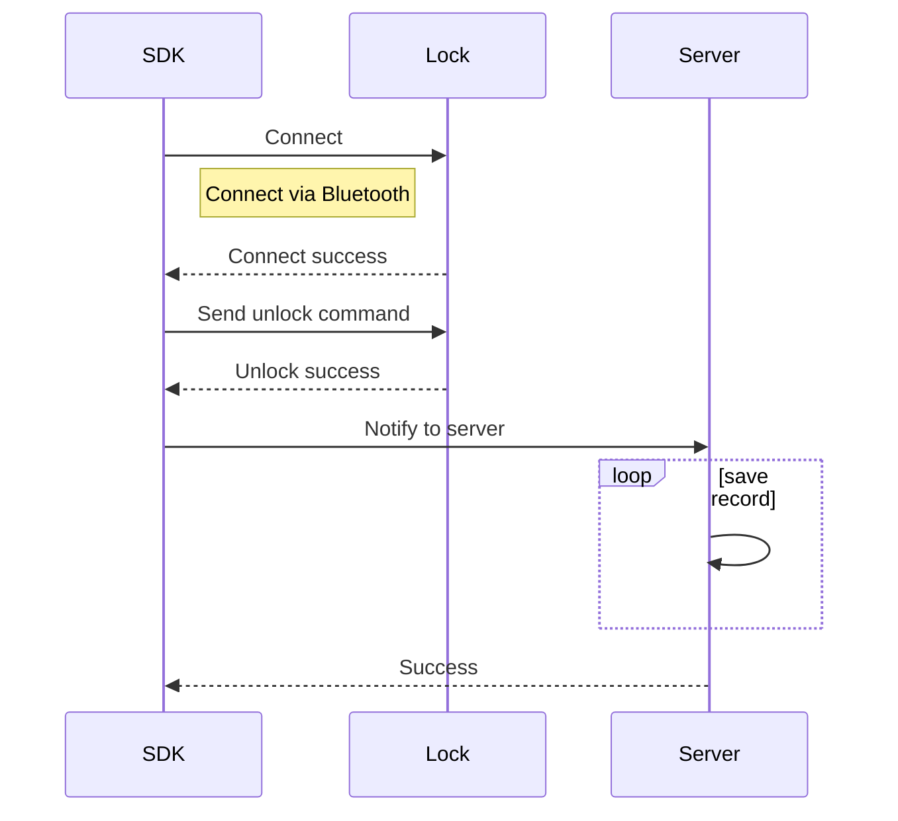
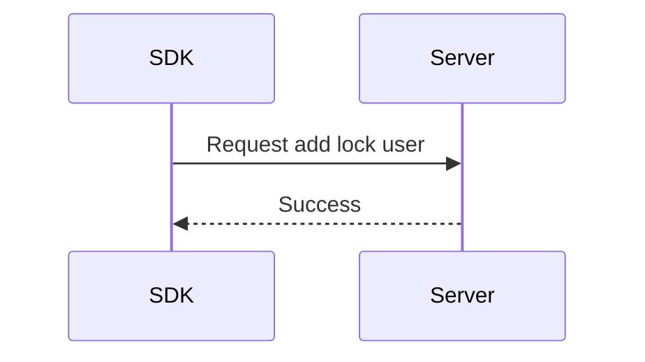
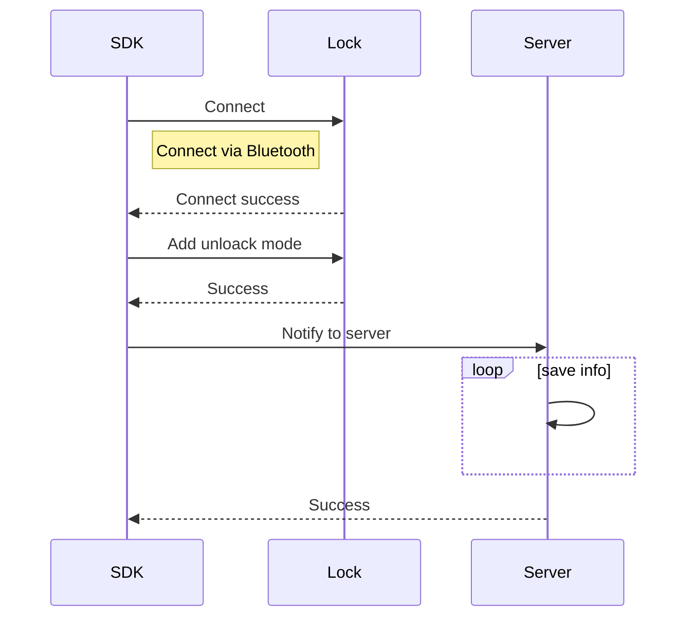

# Tuya BLE Lock

Before accessing the Bluetooth door lock, please configure the device.

The following describes the functional interface of the Bluetooth door lock

```java
	// init sdk
    TuyaOptimusSdk.init(getApplicationContext());
    // get ITuyaLockManager
    ITuyaLockManager tuyaLockManager = TuyaOptimusSdk.getManager(ITuyaLockManager.class);
    // create ITuyaBleLock
    ITuyaBleLock tuyaLockDevice = tuyaLockManager.getBleLock(your_device_id);
```

**Permissions**

In order to scan and connect Bluetooth devices, you need to add the following permissions to AndroidManifest.xml.

```xml
<!-- Required. Allows applications to connect to paired bluetooth devices.  -->
<uses-permission android:name="android.permission.BLUETOOTH" />
<!-- Required. Allows applications to discover and pair bluetooth devices.  -->
<uses-permission android:name="android.permission.BLUETOOTH_ADMIN" />
<!-- Required.  Allows an app to scan bluetooth device.  -->
<uses-permission android:name="android.permission.ACCESS_FINE_LOCATION" />
<!-- Required.  Allows an app to scan bluetooth device.  -->
<uses-permission android:name="android.permission.ACCESS_COARSE_LOCATION" />
<!--  Allows an app to use bluetooth low energy feature  -->
<uses-feature
	android:name="android.hardware.bluetooth_le"
	android:required="false" />
```

You can refer to the documentation for dynamic permission acquisition，[Request App Permissions](https://developer.android.com/training/permissions/requesting?hl=en#make-the-request)。

## Lock or Unlock Door with Bluetooth

After the Bluetooth connection is established between the mobile phone and the device, the door lock can be opened via Bluetooth.

The following figure illustrates the complete interaction process of unlocking:



### Determine the Lock Is Connected

**Description**

Determine whether the Bluetooth door lock is connected to the mobile phone.

The operations related to controlling the door lock basically need to call this interface to judge, and the door lock must be online to operate.

```java
/**
 *  @return if lock online, return true
 */
public boolean isOnline() 
```

**Example**

```java
boolean online = tuyaLockDevice.isOnline();
```

### Connect Bluetooth Door Lock

**Description**

If the door lock is not connected, call this interface to connect to the door lock

```java
/**
 * connect to lock
 *
 * @param connectListener callback BLE lock connect status
 */
public void connect(ConnectListener connectListener)
```

**Parameters**

`ConnectListener` is the callback of device connection status, `onStatusChanged` will return online status.

**Example**

```java
tuyaLockDevice.connect(new ConnectListener() {
    @Override
    public void onStatusChanged(boolean online) {
        Log.i(TAG, "onStatusChanged  online: " + online);
    }
});
```

### Unlock via Bluetooth

**Description**

After the door lock is connected with the app, you can call this interface to unlock it.

```java
/**
 * unlock the door
 */
public void unlock(String lockUserId)
```

**Parameters**

|Parameter|Description|
|---|---|
| lockUserId |The user id in the door lock device |

All users will have a corresponding id in the door lock, the id starts from 1, and the number will increase by one for each new user added.

**Example**

```java
// "1" is the id of the current user in the door lock device
tuyaLockDevice.unlock("1");
```

### Lock via Bluetooth
**Description**

After the door lock is connected with the app, you can call this interface to lock it.

```java
/**
 * lock the door
 */
public void lock()
```

**Example**

```java
tuyaLockDevice.lock();
```

## User Management

The door lock can be divided into family members and non-family members. Family members are concepts in the whole house intelligence, you can refer to the family member management for details

### Get Home Users
**Description**

Home users are users who have registered accounts and can log in to the app.

```java
/**
 * get home users
 */
public void getHomeUsers(final ITuyaResultCallback<List<BLELockUser>> callback)
```

**Parameters**

**`BLELockUser ` data model**

|Field|Type|Description|
|---|---|---|
|userId|String|user id|
|lockUserId|int|user id in lock device|
|userContact|String|user contact|
|nickName|String|user nick name|
|avatarUrl|String|avatar url|
|userType|int|User type, 10 is administrator, 20 is ordinary home user, 30 is door lock user|
|supportUnlockTypes|List<String>|Supported unlock types, you can check the unlock type in TuyaUnlockType|
|effectiveTimestamp|long|User effective timestamp, unit ms|
|invalidTimestamp| long |User failure timestamp, unit ms|


**Example**

```java
tuyaLockDevice.getHomeUsers(new ITuyaResultCallback<List<BLELockUser>>() {
    @Override
    public void onError(String code, String message) {
        Log.e(TAG, "get lock users failed: code = " + code + "  message = " + message);
    }

    @Override
    public void onSuccess(List<BLELockUser> user) {
        Log.i(TAG, "get lock users success: lockUserBean = " + user);
    }
});
```

### Get Lock Users
**Description**

The door lock user is a user created through the newly added door lock user interface and cannot be used to log in. It can only be used to associate unlock records.

```java
/**
 * get lock users
 */
public void getLockUsers(final ITuyaResultCallback<List<BLELockUser>> callback)
```

**Example**

```java
tuyaLockDevice.getLockUsers(new ITuyaResultCallback<List<BLELockUser>>() {
    @Override
    public void onError(String code, String message) {
        Log.e(TAG, "get lock users failed: code = " + code + "  message = " + message);
    }

    @Override
    public void onSuccess(List<BLELockUser> user) {
        Log.i(TAG, "get lock users success: lockUserBean = " + user);
    }
});
```

### Add Door Lock User



**Description**

Add door lock users.

Note that the non-family members created here are only associated with unlocking records. The management of family users needs to refer to the document [Family Management](https://tuyainc.github.io/tuyasmart_home_android_sdk_doc/en/resource/HomeManager.html).

```java
/**
 * add lock user
 *
 * @param userName           userName
 * @param allowedUnlock      Whether allowed unlock with bluetooth
 * @param permanent          Whether the user is permanent
 * @param effectiveTimestamp User effective time
 * @param invalidTimestamp   User invalid time
 * @param avatarFile         avatar
 * @param callback           callback
 */
void addLockUser(final String userName, boolean allowedUnlock, boolean permanent, long effectiveTimestamp, long invalidTimestamp, File avatarFile, final ITuyaResultCallback<Boolean> callback);
```

**Parameters**

|Parameter|Description|
|---|---|
| userName |user name|
| allowedUnlock |Allow users to unlock using Bluetooth|
| unlockType |Unlock type, you can check TuyaUnlockType|
| permanent |Whether it is a permanent user|
| effectiveTimestamp |User effective timestamp, unit ms, if the permanent value is true, the value can be ignored|
| invalidTimestamp |User expiry timestamp, unit ms, if the permanent value is true, this value can be ignored|
| avatarFile |avatar file|

**Example**

```java
tuyaLockDevice.addLockUser("your_user_name", true, true, 0, 0, null, new ITuyaResultCallback<Boolean>() {
    @Override
    public void onError(String code, String message) {
        Log.e(TAG, "add lock user failed: code = " + code + "  message = " + message);
    }

    @Override
    public void onSuccess(Boolean result) {
        Log.i(TAG, "add lock user success");
    }
});
```

### Update Door Lock Users

**Description**

Update door lock users.

Note that the non-family members created here are only associated with unlocking records. The management of family users needs to refer to the document [Family Management](https://tuyainc.github.io/tuyasmart_home_android_sdk_doc/en/resource/HomeManager.html).

```java
/**
 * update lock user
 *
 * @param userId             userId
 * @param userName           userName
 * @param allowedUnlock      Whether allowed unlock with bluetooth
 * @param permanent          Whether the user is permanent
 * @param effectiveTimestamp User effective time
 * @param invalidTimestamp   User invalid time
 * @param avatarFile         avatar
 * @param callback           callback
 */
void updateLockUser(final String userId, boolean allowedUnlock, final String userName, final boolean permanent, long effectiveTimestamp, long invalidTimestamp, File avatarFile, final ITuyaResultCallback<Boolean> callback);

```

**Parameters**

|Parameter|Description|
|---|---|
| userId | user id |
| allowedUnlock |Allow users to unlock using Bluetooth|
| userName |user name|
| permanent |Whether it is a permanent user|
| effectiveTimestamp |User effective timestamp, unit ms, if the permanent value is true, the value can be ignored|
| invalidTimestamp |User expiry timestamp, unit ms, if the permanent value is true, this value can be ignored|
| avatarFile |avatar file|

**Example**

```java
tuyaLockDevice.updateLockUser("your_user_id", true, "your_user_name", true, 0, 0, null, new ITuyaResultCallback<Boolean>() {
    @Override
    public void onError(String code, String message) {
        Log.e(TAG, "update lock user failed: code = " + code + "  message = " + message);
    }

    @Override
    public void onSuccess(Boolean aBoolean) {
        Log.i(TAG, "update lock user success");
    }
});
```

### Delete Lock User

Note that only the door lock user can be deleted here. The management of family users needs to refer to the document [Family Management](https://tuyainc.github.io/tuyasmart_home_android_sdk_doc/en/resource/HomeManager.html).

**Description**

```java
/**
 * delete lock user
 * @param user user bean
 * @param callback  callback
 */
public void deleteLockUser(BLELockUser user, final ITuyaResultCallback<Boolean> callback)
```


### Get Users by User Id
**Description**

```java
/**
 * get user info by userId
 * @param userId userId
 * @param callback callback
 */
public void getUser(String userId, final ITuyaResultCallback<BLELockUser> callback)
```

**Parameters**

|Parameter|Description|
|---|---|
| userId |user id|


### Get User of the Current User
**Description**

```java
/**
 * get current user info
 * @param userId userId
 * @param callback callback
 */
public void getCurrentUser(final ITuyaResultCallback<BLELockUser> callback)
```

## Get Operation Records
   
### Get Unlocked Records

**Description**

```java
/**
 * get unlock records
 * @param unlockTypes unlock type list 
 * @param offset page number
 * @param limit item count
 * @param callback callback
 */
void getUnlockRecords(List<String> unlockTypes, int offset, int limit, final ITuyaResultCallback<Record> callback);
```

**Parameters**

|Parameter|Description|
|---|---|
| unlockTypes |List of unlocking types|
|offset|page offset|
|limit|item count in one page|


**Example**

```java
ArrayList<String> unlockTypes = new ArrayList<>();
unlockTypes(TuyaUnlockType.BLE);
tuyaLockDevice.getUnlockRecords(unlockTypes, 0, 10, new ITuyaResultCallback<Record>() {
    @Override
    public void onError(String code, String message) {
        Log.e(TAG, "get unlock records failed: code = " + code + "  message = " + message);
    }

    @Override
    public void onSuccess(Record recordBean) {
        Log.i(TAG, "get unlock records success: recordBean = " + recordBean);
    }
});
```
### Get Alarm Records

**Description**

According to the dp point to get the record you want to get.

```java
/**
 * get records by dpCodes
 * @param dpCodes dp codes of record
 * @param offset page number
 * @param limit item count
 * @param callback callback
 */
void getRecords(List<String> dpCodes, int offset, int limit, final ITuyaResultCallback<Record> callback);
```


**Parameters**

|Parameter|Description|
|---|---|
| unlockTypes |List of unlocking types|
|offset|page offset|
|limit|item count in one page|

**Example**

```java
ArrayList<String> dpCodes = new ArrayList<>();
dpCodes.add("alarm_lock");
dpCodes.add("doorbell");
tuyaLockDevice.getRecords(dpCodes, 0, 10, new ITuyaResultCallback<Record>() {
    @Override
    public void onError(String code, String message) {
        Log.e(TAG, "get lock records failed: code = " + code + "  message = " + message);
    }

    @Override
    public void onSuccess(Record recordBean) {
        Log.i(TAG, "get lock records success: recordBean = " + recordBean);
    }
});
```

## Unlock Mode Management
  
This section provides interfaces for setting, modifying, and deleting unlocking methods.

The following figure shows the interactive process of adding an unlock method:



### Get Unlock Modes

**Description**

```java
/**
 * get unlock mode by unlockType
 *
 * @param unlockType unlock type {@link com.tuya.smart.optimus.lock.api.TuyaUnlockType}
 * @param callback callback
 */
void getUnlockModeList(String unlockType, final ITuyaResultCallback<ArrayList<UnlockMode>> callback);
```


**Parameters**

**`UnlockMode` data model**

|Field|Type|Description|
|---|---|---|
|userId|String|user id|
|lockUserId|int|user id in door lock device|
|userName|String|user name|
|unlockAttr|int|Unlock mode attribute, 0 is the ordinary unlock mode, 1 is the unlock mode|
|userType|int|User type, 10 is administrator, 20 is ordinary home user, 30 is door lock user|
|unlockModeId|String|The id of the current unlock mode on the server|
|unlockId|String|The id of the current unlock mode in the door lock|
|unlockName|String|The name of the current unlock mode|
|unlockType|String|unlock type，see TuyaUnlockType|

**Example**

```java
tuyaLockDevice.getUnlockModeList(TuyaUnlockType.PASSWORD, new ITuyaResultCallback<ArrayList<UnlockMode>>() {
    @Override
    public void onSuccess(ArrayList<UnlockMode> result) {
        Log.i(TAG, "getUnlockModeList  onSuccess: " + result);
    }

    @Override
    public void onError(String errorCode, String errorMessage) {
        Log.e(TAG, "getUnlockModeList failed: code = " + errorCode + "  message = " + errorMessage);
    }
});
```


### Register Unlock Mode Listener
    
The interfaces for adding, modifying, and deleting unlocking methods are all asynchronous calls and all return from this interface.

**Description**

```java
void setUnlockModeListener(UnlockModeListener unlockModeListener);
```

The code in `UnlockModeListener` is as follows:


```java
public interface UnlockModeListener {

    /**
     * Unlock mode parameter is illegal
     */
    int FAILED_STATUS_ILLEGAL_ARGUMENT = -1;
    /**
     * The current operation does not support this unlock type
     */
    int FAILED_STATUS_NOT_SUPPORT_UNLOCK_TYPE = -2;
    /**
     * Send command failed
     */
    int FAILED_STATUS_SEND_ERROR = -3;
    /**
     * Request to server failed
     */
    int FAILED_STATUS_REQUEST_SERVER_ERROR = -4;
    /**
     * Incomplete fingerprint
     */
    int FAILED_STATUS_FINGERPRINT_INCOMPLETE = -5;
    /**
     * Server response failed
     */
    int FAILED_STATUS_SERVER_RESPONSE_FAILED = -6;
    /**
     * Door lock response failed
     */
    int FAILED_STATUS_LOCK_RESPONSE_FAILED = -7;
    /*-----The following states are defined in the door lock, and the return code that fails to create the unlock mode is created-------*/
    int FAILED_STATUS_TIMEOUT = 0x00;
    int FAILED_STATUS_FAILED = 0x01;
    int FAILED_STATUS_REPEAT = 0x02;
    int FAILED_STATUS_LOCK_ID_EXHAUSTED = 0x03;
    int FAILED_STATUS_PASSWORD_NOT_NUMBER = 0x04;
    int FAILED_STATUS_PASSWORD_WRONG_LENGTH = 0x05;
    int FAILED_STATUS_NOT_SUPPORT = 0x06;
    int FAILED_STATUS_ALREADY_ENTERED = 0x07;
    int FAILED_STATUS_ALREADY_BOUND_CARD = 0x08;
    int FAILED_STATUS_ALREADY_BOUND_FACE = 0x09;
    int FAILED_STATUS_PASSWORD_TOO_SIMPLE = 0x0A;
    int FAILED_STATUS_WRONG_LOCK_ID = 0xFE;

    /**
     * Callback methods for adding, deleting, and modifying door
     *
     * @param devId              device id
     * @param userId             user id
     * @param unlockModeResponse unlockModeResponse
     */
    void onResult(String devId, String userId, UnlockModeResponse unlockModeResponse);
}
```

**Parameters**


|Field|Type|Description|
|---|---|---|
|unlockMethod|String|The current method of operating the door lock has three values:<br>/** Add unlock mode  \*/ <br/>public static final String UNLOCK\_METHOD\_CREATE = "unlock\_method\_create"; <br/>/** Modify  \*/ <br/>public static final String UNLOCK\_METHOD\_MODIFY = "unlock\_method\_modify";<br/> /** Delete  \*/ <br/>public static final String UNLOCK\_METHOD\_DELETE = "unlock\_method\_delete";|
|unlockType|String|unlock type，see TuyaUnlockType|
|stage|int|The current stage of operating the door lock is defined in BleLockConstant. Details are as follows:<br>int STAGE_AFTER = -2; // After the operation door lock is completed, synchronize the data with the server<br/>int STAGE_BEFORE = -1;// Before interacting with the door lock, such as sending commands and interacting with the server<br/> int STAGE_START = 0x00; // start<br/>int STAGE_CANCEL = 0xFE;// cancel<br/> int STAGE_FAILED = 0xFD;// failed <br/>int STAGE_ENTERING = 0xFC;// entering<br/> int STAGE_SUCCESS = 0xFF;// success|
|lockUserId|int|user id in door lock device|
|unlockId|int|Unlock mode id in door lock device|
|unlockModeId|String|Unlock mode id |
|admin|boolean|Is it an administrator|
|times|int|0 means permanently effective, 1 ~ 254 means actual effective times, other numbers are invalid|
|status|int|Failed status code, see UnlockModeListener|
|failedStage|int|The stage at which the failure occurred. |

**Example**

```java
tuyaLockDevice.setUnlockModeListener(new UnlockModeListener() {
  @Override
  public void onResult(String devId, String userId, UnlockModeResponse unlockModeResponse) {
    Log.i(TAG, "UnlockModeListener devId: " + devId);
    Log.i(TAG, "UnlockModeListener userId: " + userId);
    Log.i(TAG, "UnlockModeListener unlockType: " + unlockModeResponse.unlockType);
    Log.d(TAG, "UnlockModeListener: " + unlockModeResponse);
    if (unlockModeResponse.success) {
      if (TextUtils.equals(unlockModeResponse.unlockMethod, UnlockModeResponse.UNLOCK_METHOD_CREATE)) {
        Log.i(TAG, "Create unlock mode success");
      } else if (TextUtils.equals(unlockModeResponse.unlockMethod, UnlockModeResponse.UNLOCK_METHOD_MODIFY)) {
        Log.i(TAG, "Modify unlock mode success");
      } else if (TextUtils.equals(unlockModeResponse.unlockMethod, UnlockModeResponse.UNLOCK_METHOD_DELETE)) {
        Log.i(TAG, "Delete unlock mode success");
      }
    } else if (unlockModeResponse.stage == BleLockConstant.STAGE_FAILED) {
      if (TextUtils.equals(unlockModeResponse.unlockMethod, UnlockModeResponse.UNLOCK_METHOD_CREATE)) {
        Log.w(TAG, "Create unlock mode failed.");
        Log.w(TAG, "Create unlock mode failed reason: " + unlockModeResponse.status);
        Log.w(TAG, "Create unlock mode failed stage: " + unlockModeResponse.failedStage);
      } else if (TextUtils.equals(unlockModeResponse.unlockMethod, UnlockModeResponse.UNLOCK_METHOD_MODIFY)) {
        Log.w(TAG, "Modify unlock mode failed.");
        Log.w(TAG, "Modify unlock mode failed reason: " + unlockModeResponse.status);
        Log.w(TAG, "Modify unlock mode failed stage: " + unlockModeResponse.failedStage);
      } else if (TextUtils.equals(unlockModeResponse.unlockMethod, UnlockModeResponse.UNLOCK_METHOD_DELETE)) {
        Log.w(TAG, "Delete unlock mode failed.");
        Log.w(TAG, "Delete unlock mode failed reason: " + unlockModeResponse.status);
        Log.w(TAG, "Delete unlock mode failed stage: " + unlockModeResponse.failedStage);
      }
    }
  }
});
```

### Add Unlock Mode

**Description**

```java
/**
 * Add unlock method.
 *
 * @param unlockType TuyaUnlockType {@link com.tuya.smart.optimus.lock.api.TuyaUnlockType}
 * @param user       BLELockUser {@link com.tuya.smart.sdk.optimus.lock.bean.ble.BLELockUser}
 * @param name       Unlock mode name.
 * @param password   Unlock password. If it is not the password unlock type, this field can be null
 * @param times      Number of times the unlock mode can be used. The value range is 0 to 254, 0 means unlimited times, and 1 ~ 254 is the actual number of times.
 * @param isHijack   Hijack flag. If it is true, a hijacking alarm will be triggered when unlocking with this unlock mode.
 */
void addUnlockMode(final String unlockType, final BLELockUser user, String name, String password, int times, boolean isHijack);
```

**Parameters**

| Parameter | Description |
|---|---|
|unlockType| Unlock type，see TuyaUnlockType|
|user|BLELockUser，user data model|
|name|Unlock mode name|
|password|Unlock password. If it is not the password unlock type, this field can be null|
|times|Number of times the unlock mode can be used. The value range is 0 to 254, 0 means unlimited times, and 1 ~ 254 is the actual number of times.|
|isHijack|Hijack flag. If it is true, a hijacking alarm will be triggered when unlocking with this unlock mode.|


**Example**

Add a password for home users

```java
tuyaLockDevice.getHomeUsers(new ITuyaResultCallback<List<BLELockUser>>() {
    @Override
    public void onSuccess(List<BLELockUser> result) {
        Log.i(TAG, "getHomeUsers  onSuccess: " + result);
        // add password unlock mode
        tuyaLockDevice.addUnlockMode(TuyaUnlockType.PASSWORD, result.get(0), "test_unlock_mode1", "431232", 0, false);
    }

    @Override
    public void onError(String errorCode, String errorMessage) {
        Log.e(TAG, "getHomeUsers failed: code = " + errorCode + "  message = " + errorMessage);
    }
});
```

### Update Unlock Mode Info

**Description**

Update the name of the unlock mode and modify the hijacking mark.

This interface does not interact with the door lock, only communicates with the server.

```java
/**
 * Update name and hijack flag of the unlocking method. Only update server information, not communicate with door lock device
 *
 * @param unlockMode UnlockMode bean {@link com.tuya.smart.sdk.optimus.lock.bean.ble.UnlockMode}
 * @param name       Unlock mode name
 * @param isHijack   Hijack flag. If it is true, a hijacking alarm will be triggered when unlocking with this unlock mode.
 */
void updateUnlockModeServerInfo(UnlockMode unlockMode, String name, boolean isHijack);
```

**Parameters**

| Parameter       | Description                                                         |
| ---------- | ------------------------------------------------------------ |
| unlockMode | Unlock mode data model                                |
| name       | Unlock mode name                                       |
| isHijack   | Hijack flag. If it is true, a hijacking alarm will be triggered when unlocking with this unlock mode.|

**Example**

```java
tuyaLockDevice.getUnlockModeList(TuyaUnlockType.FINGERPRINT, new ITuyaResultCallback<ArrayList<UnlockMode>>() {
    @Override
    public void onSuccess(ArrayList<UnlockMode> result) {
        Log.i(TAG, "getUnlockModeList  onSuccess: " + result);
        for (UnlockMode unlockMode : result) {
            if (TextUtils.equals(unlockMode.unlockName, "test_unlock_mode1")) {
                tuyaLockDevice.updateUnlockModeServerInfo(unlockMode, "test_unlock2", false);// rename unlock mode
            }
        }
    }

    @Override
    public void onError(String errorCode, String errorMessage) {
        Log.e(TAG, "getUnlockModeList failed: code = " + errorCode + "  message = " + errorMessage);
    }
});
```

### Delete Unlock Mode

**Description**

```java
/**
 * Delete unlockMode.
 *
 * @param unlockMode unlockMode
 */
void deleteUnlockMode(UnlockMode unlockMode);
```

**Example**

```java
tuyaLockDevice.deleteUnlockMode(unlockMode);
```

### Fingerprint Entry Canceled

**Description**

The fingerprint unlock mode generally requires 4 to 5 fingerprints to be entered. If you need to cancel the fingerprint during the entry process, you can call this interface.

```java
/**
 * Cancel fingerprint entry.
 * <p>
 * The fingerprint entry process will be repeated multiple times and can be cancelled during the entry process.
 *
 * @param user BLELockUser {@link com.tuya.smart.sdk.optimus.lock.bean.ble.BLELockUser}
 */
void cancelFingerprintUnlockMode(final BLELockUser user);
```
### Update the Unlock mode of Password Type

**Description**

The password can be updated after the unlock mode of the password type is set. You can call this interface to modify the password name, password, unlock times, and hijack mark.

Note: Only the password type supports calling this interface.

```java
/**
 * Update the name, password, validity period and other information of the unlocking method
 *
 * @param unlockMode UnlockMode bean {@link com.tuya.smart.sdk.optimus.lock.bean.ble.UnlockMode}
 * @param name       Unlock mode name
 * @param password   Unlock password. If it is not the password unlock method, this field can be null
 * @param times      Number of times the unlock mode can be used. The value range is 0 to 254, 0 means unlimited times, and 1 ~ 254 is the actual number of times.
 * @param isHijack   Hijack flag. If it is true, a hijacking alarm will be triggered when unlocking with this unlock mode.
 */
void updatePasswordUnlockMode(UnlockMode unlockMode, String name, String password, int times, boolean isHijack);
```

**Parameters**

| Parameter       | Description                                               |
| ---------- | -------------------------------------------------- |
| unlockMode | Unlock mode data model                                |
| name       | Unlock mode name                                       |
|password|Unlock password, required for the password type, other unlock types can be empty|
|times|The number of times the password is valid. 0 means permanently effective, 1 ~ 254 means actual effective times, other numbers are invalid|
| isHijack   | Hijack flag. If it is true, a hijacking alarm will be triggered when unlocking with this unlock mode.|

**Example**

```java
tuyaLockDevice.getUnlockModeList(TuyaUnlockType.PASSWORD, new ITuyaResultCallback<ArrayList<UnlockMode>>() {
    @Override
    public void onSuccess(ArrayList<UnlockMode> result) {
        Log.i(TAG, "getUnlockModeList  onSuccess: " + result);
        for (UnlockMode unlockMode : result) {
            if (TextUtils.equals(unlockMode.unlockName, "test_password")) {
                tuyaLockDevice.updatePasswordUnlockMode(unlockMode, "test_password", "131232", 0, false);// modify password
            }
        }
    }

    @Override
    public void onError(String errorCode, String errorMessage) {
        Log.e(TAG, "getUnlockModeList failed: code = " + errorCode + "  message = " + errorMessage);
    }
});
```