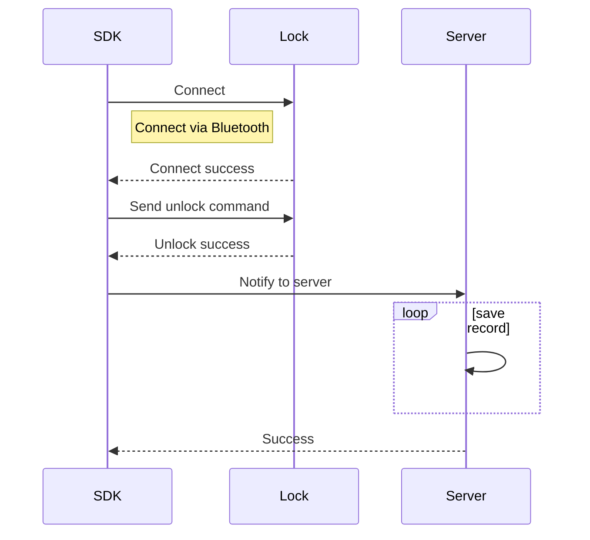
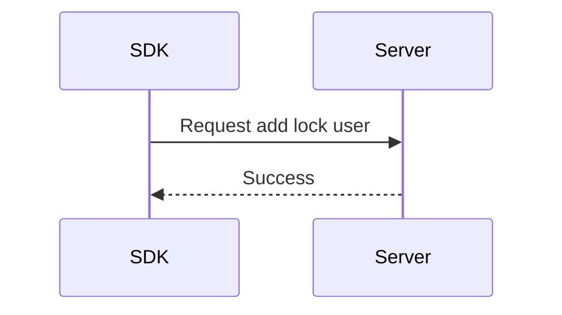
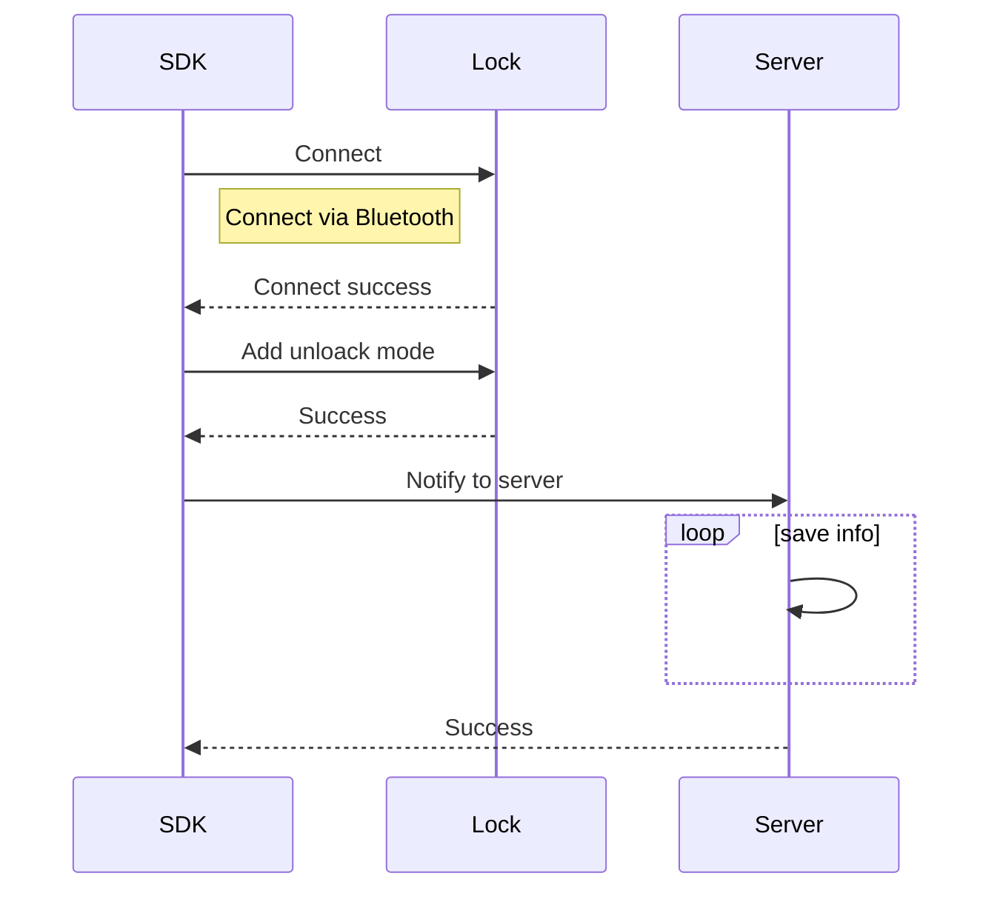

# 蓝牙门锁功能接入

接入蓝牙门锁前，请先对设备进行配网操作。

蓝牙门锁的方法均封装在 ITuyaBleLock 接口中, 通过传入设备 id 获取 ITuyaBleLock 对象后使用：

```java
// 初始化SDK，仅需要调用一次
TuyaOptimusSdk.init(getApplicationContext());
// 获取ITuyaLockManager
ITuyaLockManager tuyaLockManager = TuyaOptimusSdk.getManager(ITuyaLockManager.class);
// 创建 ITuyaBleLock
ITuyaBleLock tuyaLockDevice = tuyaLockManager.getBleLock(your_device_id);
```

**权限说明**

为了扫描和连接蓝牙设备，你需要添加下列权限到AndroidManifest.xml中。

```xml
<!-- Required. Allows applications to connect to paired bluetooth devices.  -->
<uses-permission android:name="android.permission.BLUETOOTH" />
<!-- Required. Allows applications to discover and pair bluetooth devices.  -->
<uses-permission android:name="android.permission.BLUETOOTH_ADMIN" />
<!-- Required.  Allows an app to scan bluetooth device.  -->
<uses-permission android:name="android.permission.ACCESS_FINE_LOCATION" />
<!-- Required.  Allows an app to scan bluetooth device.  -->
<uses-permission android:name="android.permission.ACCESS_COARSE_LOCATION" />
<!--  Allows an app to use bluetooth low energy feature  -->
<uses-feature
	android:name="android.hardware.bluetooth_le"
	android:required="false" />
```

动态权限获取可以参考文档，[请求运行时权限](https://developer.android.com/training/permissions/requesting?hl=zh-cn#make-the-request)。

## 开关锁控制

手机和设备建立蓝牙连接后，可以通过蓝牙打开门锁。

下图说明了开锁完整的交互过程：



### 判断门锁是否在线

**接口说明**

判断蓝牙门锁是否和手机连接。

控制门锁相关的操作基本都需要调用这个接口判断，必须门锁是在线状态才能操作。

```java
/**
 *  @return if lock online, return true
 */
public boolean isOnline() 
```

**示例代码**

```java
boolean online = tuyaLockDevice.isOnline();
```

### 连接蓝牙门锁

**接口说明**

如果判断门锁未连接，调用此接口连接到门锁

```java
/**
 * connect to lock
 *
 * @param connectListener callback BLE lock connect status
 */
public void connect(ConnectListener connectListener)
```

**参数说明**

ConnectListener为设备连接状态回调，其中的onStatusChanged将返回在线状态。

**示例代码**

```java
tuyaLockDevice.connect(new ConnectListener() {
    @Override
    public void onStatusChanged(boolean online) {
        Log.i(TAG, "onStatusChanged  online: " + online);
    }
});
```

### 通过蓝牙解锁

**接口说明**

门锁与app连接后，可调用此接口解锁。

```java
/**
 * unlock the door
 */
public void unlock(String lockUserId)
```

**参数说明**

|参数|说明|
|---|---|
| lockUserId |门锁设备中的用户id|

所有用户在门锁中都会有一个对应的id，id从1开始，每添加一个新用户数字加一。

**示例代码**

```java
// "1"是当前用户在门锁设备中的id
tuyaLockDevice.unlock("1");
```

### 通过蓝牙上锁
**接口说明**

门锁与app连接后，可调用此接口上锁。

```java
/**
 * lock the door
 */
public void lock()
```

**示例代码**

```java
tuyaLockDevice.lock();
```

## 门锁用户管理
门锁内可以分为家庭成员和非家庭成员，家庭成员为全屋智能中的概念，具体可以查阅家庭成员管理

### 获取家庭用户
**接口说明**

获取门锁设备中的家庭成员。家庭成员即注册了帐号的用户，可登录app。

```java
/**
 * get home users
 */
public void getHomeUsers(final ITuyaResultCallback<List<BLELockUser>> callback)
```

**参数说明**

**`BLELockUser ` 数据模型**

|字段|类型|描述|
|---|---|---|
|userId|String|用户id|
|lockUserId|int|门锁中的用户id|
|userContact|String|联系方式|
|nickName|String|昵称|
|avatarUrl|String|头像url|
|userType|int|用户类型，10为管理员，20为普通家庭用户，30为门锁用户|
|supportUnlockTypes|List<String>|支持的解锁类型，可以查看TuyaUnlockType中的解锁方式|
|effectiveTimestamp|long|用户生效时间戳，单位 ms|
|invalidTimestamp| long |用户失效时间戳，单位 ms|


**示例代码**

```java
tuyaLockDevice.getHomeUsers(new ITuyaResultCallback<List<BLELockUser>>() {
    @Override
    public void onError(String code, String message) {
        Log.e(TAG, "get lock users failed: code = " + code + "  message = " + message);
    }

    @Override
    public void onSuccess(List<BLELockUser> user) {
        Log.i(TAG, "get lock users success: lockUserBean = " + user);
    }
});
```

### 获取门锁用户
**接口说明**

获取添加的门锁用户。门锁用户是通过新增门锁用户接口创建的用户，无法用来登录，仅可用来关联开锁记录。

```java
/**
 * get lock users
 */
public void getLockUsers(final ITuyaResultCallback<List<BLELockUser>> callback)
```

**示例代码**

```java
tuyaLockDevice.getLockUsers(new ITuyaResultCallback<List<BLELockUser>>() {
    @Override
    public void onError(String code, String message) {
        Log.e(TAG, "get lock users failed: code = " + code + "  message = " + message);
    }

    @Override
    public void onSuccess(List<BLELockUser> user) {
        Log.i(TAG, "get lock users success: lockUserBean = " + user);
    }
});
```

### 新增门锁用户



**接口说明**

添加门锁用户。

注意，这里创建的非家庭成员，仅供与开锁记录关联。家庭用户的管理需要参考文档[家庭成员管理](https://tuyainc.github.io/tuyasmart_home_android_sdk_doc/zh-hans/resource/HomeMember.html)

```java
/**
 * add lock user
 *
 * @param userName           userName
 * @param allowedUnlock      Whether allowed unlock with bluetooth
 * @param permanent          Whether the user is permanent
 * @param effectiveTimestamp User effective time
 * @param invalidTimestamp   User invalid time
 * @param avatarFile         avatar
 * @param callback           callback
 */
void addLockUser(final String userName, boolean allowedUnlock, boolean permanent, long effectiveTimestamp, long invalidTimestamp, File avatarFile, final ITuyaResultCallback<Boolean> callback);
```

**参数说明**

|参数|说明|
|---|---|
| userName |用户名称|
| allowedUnlock |允许用户使用蓝牙开锁|
| unlockType |解锁方式，可查看TuyaUnlockType类|
| permanent |是否是永久用户|
| effectiveTimestamp |用户生效时间戳，单位ms, 如果permanent 值为true，则该值可忽略|
| invalidTimestamp |用户失效时间戳，单位ms, 如果permanent 值为true，则该值可忽略|
| avatarFile |用户头像文件|

**示例代码**

```java
tuyaLockDevice.addLockUser("your_user_name", true, true, 0, 0, null, new ITuyaResultCallback<Boolean>() {
    @Override
    public void onError(String code, String message) {
        Log.e(TAG, "add lock user failed: code = " + code + "  message = " + message);
    }

    @Override
    public void onSuccess(Boolean result) {
        Log.i(TAG, "add lock user success");
    }
});
```

### 更新门锁用户

**接口说明**

更新门锁用户。

注意，这里创建的非家庭成员，仅供与开锁记录关联。家庭用户的管理需要参考文档[家庭成员管理](https://tuyainc.github.io/tuyasmart_home_android_sdk_doc/zh-hans/resource/HomeMember.html)

```java
/**
 * update lock user
 *
 * @param userId             userId
 * @param userName           userName
 * @param allowedUnlock      Whether allowed unlock with bluetooth
 * @param permanent          Whether the user is permanent
 * @param effectiveTimestamp User effective time
 * @param invalidTimestamp   User invalid time
 * @param avatarFile         avatar
 * @param callback           callback
 */
void updateLockUser(final String userId, boolean allowedUnlock, final String userName, final boolean permanent, long effectiveTimestamp, long invalidTimestamp, File avatarFile, final ITuyaResultCallback<Boolean> callback);

```

**参数说明**

|参数|说明|
|---|---|
| userId |用户id|
| allowedUnlock |允许用户使用蓝牙开锁|
| userName |用户名称|
| permanent |是否是永久用户|
| effectiveTimestamp |用户生效时间戳，单位ms, 如果permanent 值为true，则该值可忽略|
| invalidTimestamp |用户失效时间戳，单位ms, 如果permanent 值为true，则该值可忽略|
| avatarFile |用户头像文件|

**示例代码**

```java
tuyaLockDevice.updateLockUser("your_user_id", true, "your_user_name", true, 0, 0, null, new ITuyaResultCallback<Boolean>() {
    @Override
    public void onError(String code, String message) {
        Log.e(TAG, "update lock user failed: code = " + code + "  message = " + message);
    }

    @Override
    public void onSuccess(Boolean aBoolean) {
        Log.i(TAG, "update lock user success");
    }
});
```

### 删除门锁用户

更新门锁用户。

注意吗，这里只能删除门锁用户，家庭用户的管理需要参考文档[家庭成员管理](https://tuyainc.github.io/tuyasmart_home_android_sdk_doc/zh-hans/resource/HomeMember.html)

**接口说明**

```java
/**
 * delete lock user
 * @param user user bean
 * @param callback  callback
 */
public void deleteLockUser(BLELockUser user, final ITuyaResultCallback<Boolean> callback)
```


### 根据用户id获取用户
**接口说明**

```java
/**
 * get user info by userId
 * @param userId userId
 * @param callback callback
 */
public void getUser(String userId, final ITuyaResultCallback<BLELockUser> callback)
```

**参数说明**

|参数|说明|
|---|---|
| userId |用户id|


### 获取当前登录的用户的用户信息
**接口说明**

```java
/**
 * get current user info
 * @param userId userId
 * @param callback callback
 */
public void getCurrentUser(final ITuyaResultCallback<BLELockUser> callback)
```

## 获取门锁操作记录

### 获取解锁记录

**接口说明**

```java
/**
 * get unlock records
 * @param unlockTypes unlock type list 
 * @param offset page number
 * @param limit item count
 * @param callback callback
 */
void getUnlockRecords(List<String> unlockTypes, int offset, int limit, final ITuyaResultCallback<Record> callback);
```

**参数说明**

|参数|说明|
|---|---|
| unlockTypes |解锁方式列表|
| offset |记录页码|
| limit |返回的记录条目数量|


**示例代码**

```java
ArrayList<String> unlockTypes = new ArrayList<>();
unlockTypes(TuyaUnlockType.BLE);
tuyaLockDevice.getUnlockRecords(unlockTypes, 0, 10, new ITuyaResultCallback<Record>() {
    @Override
    public void onError(String code, String message) {
        Log.e(TAG, "get unlock records failed: code = " + code + "  message = " + message);
    }

    @Override
    public void onSuccess(Record recordBean) {
        Log.i(TAG, "get unlock records success: recordBean = " + recordBean);
    }
});
```
### 获取告警记录

**接口说明**

根据dp点获取你想获取的记录。

```java
/**
 * get records by dpCodes
 * @param dpCodes dp codes of record
 * @param offset page number
 * @param limit item count
 * @param callback callback
 */
void getRecords(List<String> dpCodes, int offset, int limit, final ITuyaResultCallback<Record> callback);
```


**参数说明**

|参数|说明|
|---|---|
| unlockTypes |解锁方式列表|
| offset |记录页码|
| limit |返回的记录条目数量|

**示例代码**

```java
ArrayList<String> dpCodes = new ArrayList<>();
dpCodes.add("alarm_lock");
dpCodes.add("doorbell");
tuyaLockDevice.getRecords(dpCodes, 0, 10, new ITuyaResultCallback<Record>() {
    @Override
    public void onError(String code, String message) {
        Log.e(TAG, "get lock records failed: code = " + code + "  message = " + message);
    }

    @Override
    public void onSuccess(Record recordBean) {
        Log.i(TAG, "get lock records success: recordBean = " + recordBean);
    }
});
```

## 解锁方式管理

本节提供设置、修改、删除解锁方式的接口。

下图为添加解锁方式的交互过程：



### 获取解锁方式列表

**接口说明**

```java
/**
 * get unlock mode by unlockType
 *
 * @param unlockType unlock type {@link com.tuya.smart.optimus.lock.api.TuyaUnlockType}
 * @param callback callback
 */
void getUnlockModeList(String unlockType, final ITuyaResultCallback<ArrayList<UnlockMode>> callback);
```


**参数说明**

**`UnlockMode` 数据模型**

|字段|类型|描述|
|---|---|---|
|userId|String|用户id|
|lockUserId|int|门锁中的用户id|
|userName|String|用户昵称|
|unlockAttr|int|解锁方式属性，0是普通密码，1是劫持密码|
|userType|int|用户类型，10为管理员，20是普通用户，30是门锁用户|
|unlockModeId|String|当前解锁方式在服务端的id|
|unlockId|String|当前解锁方式在门锁中的id|
|unlockName|String|当前解锁方式的名称|
|unlockType|String|解锁方式类型，参见TuyaUnlockType|

**示例代码**

```java
tuyaLockDevice.getUnlockModeList(TuyaUnlockType.PASSWORD, new ITuyaResultCallback<ArrayList<UnlockMode>>() {
    @Override
    public void onSuccess(ArrayList<UnlockMode> result) {
        Log.i(TAG, "getUnlockModeList  onSuccess: " + result);
    }

    @Override
    public void onError(String errorCode, String errorMessage) {
        Log.e(TAG, "getUnlockModeList failed: code = " + errorCode + "  message = " + errorMessage);
    }
});
```


### 注册开门方式监听


添加、修改、删除开锁方式的接口均为异步调用，都是从这个接口返回。

**接口说明**

注册开门方式监听

```java
void setUnlockModeListener(UnlockModeListener unlockModeListener);
```

其中`UnlockModeListener`中代码如下：


```java
public interface UnlockModeListener {

    /**
     * 解锁方式参数丢失
     */
    int FAILED_STATUS_ILLEGAL_ARGUMENT = -1;
    /**
     * 当前操作不支持此开锁方式
     */
    int FAILED_STATUS_NOT_SUPPORT_UNLOCK_TYPE = -2;
    /**
     * 控制指令发送失败
     */
    int FAILED_STATUS_SEND_ERROR = -3;
    /**
     * 请求服务端失败
     */
    int FAILED_STATUS_REQUEST_SERVER_ERROR = -4;
    /**
     * 指纹不完整
     */
    int FAILED_STATUS_FINGERPRINT_INCOMPLETE = -5;
    /**
     * 服务端响应失败
     */
    int FAILED_STATUS_SERVER_RESPONSE_FAILED = -6;
    /**
     * 门锁响应失败
     */
    int FAILED_STATUS_LOCK_RESPONSE_FAILED = -7;
    /*-----以下状态为门锁中定义，创建开锁方式失败的返回码-------*/
    int FAILED_STATUS_TIMEOUT = 0x00;
    int FAILED_STATUS_FAILED = 0x01;
    int FAILED_STATUS_REPEAT = 0x02;
    int FAILED_STATUS_LOCK_ID_EXHAUSTED = 0x03;
    int FAILED_STATUS_PASSWORD_NOT_NUMBER = 0x04;
    int FAILED_STATUS_PASSWORD_WRONG_LENGTH = 0x05;
    int FAILED_STATUS_NOT_SUPPORT = 0x06;
    int FAILED_STATUS_ALREADY_ENTERED = 0x07;
    int FAILED_STATUS_ALREADY_BOUND_CARD = 0x08;
    int FAILED_STATUS_ALREADY_BOUND_FACE = 0x09;
    int FAILED_STATUS_PASSWORD_TOO_SIMPLE = 0x0A;
    int FAILED_STATUS_WRONG_LOCK_ID = 0xFE;

    /**
     * 开门方式添加、删除、修改的回调方法
     *
     * @param devId              设备id
     * @param userId             用户id
     * @param unlockModeResponse 响应数据
     */
    void onResult(String devId, String userId, UnlockModeResponse unlockModeResponse);
}
```

**参数说明**


|字段|类型|描述|
|---|---|---|
|unlockMethod|String|当前操作门锁的方法类型，其值有以下三个：<br>/** 添加开锁方式  \*/ <br/>public static final String UNLOCK\_METHOD\_CREATE = "unlock\_method\_create"; <br/>/** 修改开锁方式  \*/ <br/>public static final String UNLOCK\_METHOD\_MODIFY = "unlock\_method\_modify";<br/> /** 删除开锁方式  \*/ <br/>public static final String UNLOCK\_METHOD\_DELETE = "unlock\_method\_delete";|
|unlockType|String|解锁方式类型，参见TuyaUnlockType|
|stage|int|当前操作门锁所处的阶段，其值定义在`BleLockConstant`中，详情如下：<br>int STAGE_AFTER = -2; // 操作门锁完成之后，和服务端同步数据<br/>int STAGE_BEFORE = -1;// 与门锁交互之前，如发送命令、和服务端交互<br/> int STAGE_START = 0x00; // 开始录入解锁方式<br/>int STAGE_CANCEL = 0xFE;// 解锁方式录入取消<br/> int STAGE_FAILED = 0xFD;// 解锁方式录入失败 <br/>int STAGE_ENTERING = 0xFC;// 解锁方式录入中<br/> int STAGE_SUCCESS = 0xFF;// 解锁方式录入成功|
|lockUserId|int|在门锁中的用户id|
|unlockId|int|当前解锁方式在门锁中的id|
|unlockModeId|String|当前解锁方式在服务端的id|
|admin|boolean|是否是管理员|
|times|int|0表示永久有效，1~254表示实际有效次数，其他数字无效|
|status|int|失败的状态码，详情查看UnlockModeListener|
|failedStage|int|失败发生的阶段。stage=STAGE_FAILED时才有意义|

**示例代码**

```java
tuyaLockDevice.setUnlockModeListener(new UnlockModeListener() {
  @Override
  public void onResult(String devId, String userId, UnlockModeResponse unlockModeResponse) {
    Log.i(TAG, "UnlockModeListener devId: " + devId);
    Log.i(TAG, "UnlockModeListener userId: " + userId);
    Log.i(TAG, "UnlockModeListener unlockType: " + unlockModeResponse.unlockType);
    Log.d(TAG, "UnlockModeListener: " + unlockModeResponse);
    if (unlockModeResponse.success) {
      if (TextUtils.equals(unlockModeResponse.unlockMethod, UnlockModeResponse.UNLOCK_METHOD_CREATE)) {
        Log.i(TAG, "Create unlock mode success");
      } else if (TextUtils.equals(unlockModeResponse.unlockMethod, UnlockModeResponse.UNLOCK_METHOD_MODIFY)) {
        Log.i(TAG, "Modify unlock mode success");
      } else if (TextUtils.equals(unlockModeResponse.unlockMethod, UnlockModeResponse.UNLOCK_METHOD_DELETE)) {
        Log.i(TAG, "Delete unlock mode success");
      }
    } else if (unlockModeResponse.stage == BleLockConstant.STAGE_FAILED) {
      if (TextUtils.equals(unlockModeResponse.unlockMethod, UnlockModeResponse.UNLOCK_METHOD_CREATE)) {
        Log.w(TAG, "Create unlock mode failed.");
        Log.w(TAG, "Create unlock mode failed reason: " + unlockModeResponse.status);
        Log.w(TAG, "Create unlock mode failed stage: " + unlockModeResponse.failedStage);
      } else if (TextUtils.equals(unlockModeResponse.unlockMethod, UnlockModeResponse.UNLOCK_METHOD_MODIFY)) {
        Log.w(TAG, "Modify unlock mode failed.");
        Log.w(TAG, "Modify unlock mode failed reason: " + unlockModeResponse.status);
        Log.w(TAG, "Modify unlock mode failed stage: " + unlockModeResponse.failedStage);
      } else if (TextUtils.equals(unlockModeResponse.unlockMethod, UnlockModeResponse.UNLOCK_METHOD_DELETE)) {
        Log.w(TAG, "Delete unlock mode failed.");
        Log.w(TAG, "Delete unlock mode failed reason: " + unlockModeResponse.status);
        Log.w(TAG, "Delete unlock mode failed stage: " + unlockModeResponse.failedStage);
      }
    }
  }
});
```

### 添加开锁方式


**接口说明**

按解锁类型给用户添加解锁方式。

```java
/**
 * Add unlock method.
 *
 * @param unlockType TuyaUnlockType {@link com.tuya.smart.optimus.lock.api.TuyaUnlockType}
 * @param user       BLELockUser {@link com.tuya.smart.sdk.optimus.lock.bean.ble.BLELockUser}
 * @param name       Unlock mode name.
 * @param password   Unlock mode password. If it is not the password unlock method, this field can be null
 * @param times      Number of times the unlock mode can be used. The value range is 0 to 254, 0 means unlimited times, and 1 ~ 254 is the actual number of times.
 * @param isHijack   Hijack flag. If it is true, a hijacking alarm will be triggered when unlocking with this unlock mode.
 */
void addUnlockMode(final String unlockType, final BLELockUser user, String name, String password, int times, boolean isHijack);
```

**参数说明**

|字段|描述|
|---|---|
|unlockType|解锁方式类型，参见TuyaUnlockType|
|user|BLELockUser，用户的数据模型|
|name|解锁方式名称|
|password|解锁密码，解锁方式为密码类型必填，其他解锁方式可为空|
|times|密码有效次数。0表示永久有效，1~254表示实际有效次数，其他数字无效|
|isHijack|劫持标记，设置为true时使用该密码解锁将触发劫持告警|

**示例代码**

给家庭用户添加密码

```java
tuyaLockDevice.getHomeUsers(new ITuyaResultCallback<List<BLELockUser>>() {
    @Override
    public void onSuccess(List<BLELockUser> result) {
        Log.i(TAG, "getHomeUsers  onSuccess: " + result);
        // add password unlock mode
        tuyaLockDevice.addUnlockMode(TuyaUnlockType.PASSWORD, result.get(0), "test_unlock_mode1", "431232", 0, false);
    }

    @Override
    public void onError(String errorCode, String errorMessage) {
        Log.e(TAG, "getHomeUsers failed: code = " + errorCode + "  message = " + errorMessage);
    }
});
```

### 更新开锁方式信息

**接口说明**

更新开锁方式的名称，修改劫持标记。

此接口不与门锁交互，仅和服务端通信。

```java
/**
 * Update name and hijack flag of the unlocking method. Only update server information, not communicate with door lock device
 *
 * @param unlockMode UnlockMode bean {@link com.tuya.smart.sdk.optimus.lock.bean.ble.UnlockMode}
 * @param name       Unlock mode name
 * @param isHijack   Hijack flag. If it is true, a hijacking alarm will be triggered when unlocking with this unlock mode.
 */
void updateUnlockModeServerInfo(UnlockMode unlockMode, String name, boolean isHijack);
```

**参数说明**

| 字段       | 描述                                                         |
| ---------- | ------------------------------------------------------------ |
| unlockMode | 解锁方式数据模型                            |
| name       | 解锁方式名称                                                 |
| isHijack   | 劫持标记，设置为true时使用该密码解锁将触发劫持告警           |

**示例代码**

```java
tuyaLockDevice.getUnlockModeList(TuyaUnlockType.FINGERPRINT, new ITuyaResultCallback<ArrayList<UnlockMode>>() {
    @Override
    public void onSuccess(ArrayList<UnlockMode> result) {
        Log.i(TAG, "getUnlockModeList  onSuccess: " + result);
        for (UnlockMode unlockMode : result) {
            if (TextUtils.equals(unlockMode.unlockName, "test_unlock_mode1")) {
                tuyaLockDevice.updateUnlockModeServerInfo(unlockMode, "test_unlock2", false);// rename unlock mode
            }
        }
    }

    @Override
    public void onError(String errorCode, String errorMessage) {
        Log.e(TAG, "getUnlockModeList failed: code = " + errorCode + "  message = " + errorMessage);
    }
});
```

### 删除开锁方式

**接口说明**

删除指定的开锁方式。

```java
/**
 * Delete unlockMode.
 *
 * @param unlockMode unlockMode
 */
void deleteUnlockMode(UnlockMode unlockMode);
```

**示例代码**

```java
tuyaLockDevice.deleteUnlockMode(unlockMode);
```

### 指纹录入取消

**接口说明**

指纹解锁方式一般需要录入4到5次指纹，如果录入过程中需要取消，可以调用此接口。

```java
/**
 * Cancel fingerprint entry.
 * <p>
 * The fingerprint entry process will be repeated multiple times and can be cancelled during the entry process.
 *
 * @param user BLELockUser {@link com.tuya.smart.sdk.optimus.lock.bean.ble.BLELockUser}
 */
void cancelFingerprintUnlockMode(final BLELockUser user);
```
### 密码类型更新密码

**接口说明**

密码类型的解锁方式设置之后可以更新密码，可以调用此接口修改密码名称、密码、解锁次数和劫持标记。

注意：仅密码类型的支持调用此接口。

```java
/**
 * Update the name, password, validity period and other information of the unlocking method
 *
 * @param unlockMode UnlockMode bean {@link com.tuya.smart.sdk.optimus.lock.bean.ble.UnlockMode}
 * @param name       Unlock mode name
 * @param password   Unlock mode password. If it is not the password unlock method, this field can be null
 * @param times      Number of times the unlock mode can be used. The value range is 0 to 254, 0 means unlimited times, and 1 ~ 254 is the actual number of times.
 * @param isHijack   Hijack flag. If it is true, a hijacking alarm will be triggered when unlocking with this unlock mode.
 */
void updatePasswordUnlockMode(UnlockMode unlockMode, String name, String password, int times, boolean isHijack);
```

**参数说明**

| 字段       | 描述                                               |
| ---------- | -------------------------------------------------- |
| unlockMode | 解锁方式数据模型                                   |
| name       | 解锁方式名称                                       |
|password|解锁密码，解锁方式为密码类型必填，其他解锁方式可为空|
|times|密码有效次数。0表示永久有效，1~254表示实际有效次数，其他数字无效|
| isHijack   | 劫持标记，设置为true时使用该密码解锁将触发劫持告警 |

**示例代码**

```java
tuyaLockDevice.getUnlockModeList(TuyaUnlockType.PASSWORD, new ITuyaResultCallback<ArrayList<UnlockMode>>() {
    @Override
    public void onSuccess(ArrayList<UnlockMode> result) {
        Log.i(TAG, "getUnlockModeList  onSuccess: " + result);
        for (UnlockMode unlockMode : result) {
            if (TextUtils.equals(unlockMode.unlockName, "test_password")) {
                tuyaLockDevice.updatePasswordUnlockMode(unlockMode, "test_password", "131232", 0, false);// modify password
            }
        }
    }

    @Override
    public void onError(String errorCode, String errorMessage) {
        Log.e(TAG, "getUnlockModeList failed: code = " + errorCode + "  message = " + errorMessage);
    }
});
```